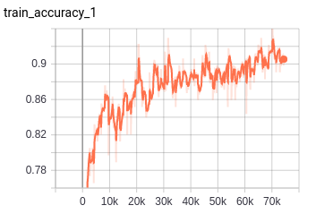
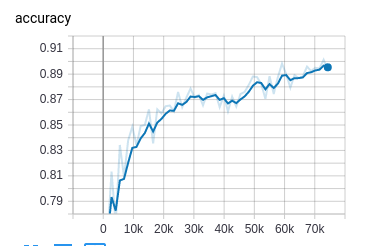
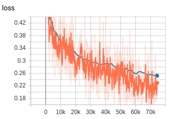

# HistopathologicCancerDetection
Histopathologic Cancer Detection in histopathologic scans of lymph node sections.

This project uses the dataset from [here](https://www.kaggle.com/c/histopathologic-cancer-detection/data)
and for performance evaluation i made an 80/20 split of the train(folder) dataset for train/validation.

The performance is 90+% accuracy on validation set.

If you want to make a kaggle submission, you can add the remaining 20%(validation) to the training set, retrain
and hopefully gain much better results.

Validation is the blue line, training is the orange one.

   

Instructions:
1) install dependencies in official/requirements.txt
2) export PYTHONPATH="$PYTHONPATH:/path/to/HistopathologicCancerDetection" 
3) Download the dataset and extract train.zip under official/histopathicC/train/ and train_labels.csv.zip under official/histopathicC/
4) python3 convertTiftoJpeg.py to convert images from .tif to .jpeg format(change path inside the file)
5) python3 createDataset.py to generate tfrecords
6) python3 Simple_model.py to train the model
